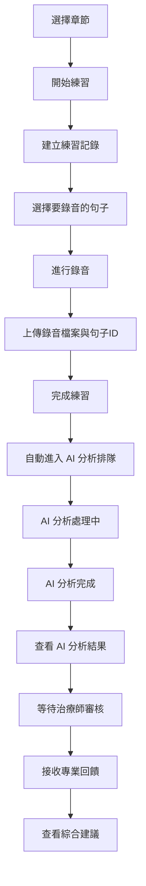
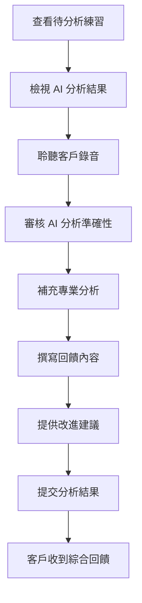
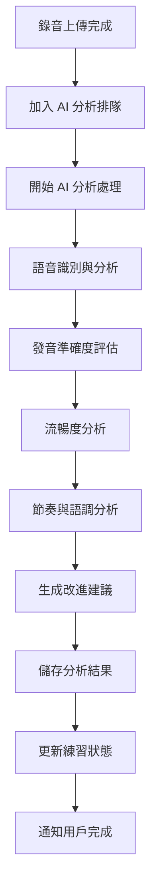

# 練習 API 功能文件

## 概述

練習 API 是 VocalBorn 語言治療學習平台的核心功能，允許語言障礙者進行語句練習、上傳錄音，並通過 AI 自動分析和治療師專業分析獲得雙重回饋。系統整合了 AI 分析引擎，提供語音評估和改進建議。

## 目標用戶

- **語言障礙者（客戶）**：練習語句發音、上傳錄音、查看 AI 分析結果和治療師回饋
- **治療師**：審核 AI 分析結果、提供專業建議和評分
- **管理員**：監控系統使用情況和 AI 分析效能

## 功能流程

### 1. 語言障礙者練習流程



### 2. 治療師分析流程



### 3. AI 分析流程



## API 端點說明

### 認證說明

所有 API 端點都需要 JWT 認證，請在 Header 中包含：
```
Authorization: Bearer <your-jwt-token>
```

### 1. 練習記錄管理

#### 🎯 開始練習

**端點：** `POST /practice/start`

**用途：** 建立新的練習記錄，開始練習階段

**請求體：**
```json
{
  "chapter_id": "550e8400-e29b-41d4-a716-446655440002",
  "begin_time": "2025-07-14T10:00:00.000Z"
}
```

**回應：**
```json
{
  "practice_record_id": "550e8400-e29b-41d4-a716-446655440004",
  "user_id": "550e8400-e29b-41d4-a716-446655440005",
  "chapter_id": "550e8400-e29b-41d4-a716-446655440002",
  "sentence_id": null,
  "practice_status": "in_progress",
  "begin_time": "2025-07-14T10:00:00.000Z",
  "created_at": "2025-07-14T10:00:00.000Z",
  "updated_at": "2025-07-14T10:00:00.000Z",
  "chapter_name": "第一章：基本對話"
}
```

#### 🎙️ 上傳練習錄音

**端點：** `POST /practice/upload/{practice_record_id}`

**用途：** 上傳練習錄音檔案並指定句子

**請求：** 使用 `multipart/form-data` 格式
- **句子ID：** `sentence_id` (form 參數)
- **音訊檔案：** `audio_file` (file 參數)

**支援格式：** MP3, WAV, M4A, OGG, WebM, FLAC, AAC

**檔案大小限制：** 50MB

**回應：**
```json
{
  "recording_id": "550e8400-e29b-41d4-a716-446655440004",
  "object_name": "practice_recordings/user123/recording456.mp3",
  "file_size": 1024000,
  "content_type": "audio/mpeg",
  "status": "uploaded"
}
```

#### 📋 取得練習記錄列表

**端點：** `GET /practice/recordings`

**用途：** 取得當前用戶的練習記錄列表

**查詢參數：**
- `skip` (int): 跳過記錄數，預設 0
- `limit` (int): 限制記錄數，預設 10
- `status` (string): 狀態篩選 (`in_progress`, `completed`, `ai_queued`, `ai_processing`, `ai_analyzed`, `analyzed`)

**回應：**
```json
{
  "total": 25,
  "practice_records": [
    {
      "practice_record_id": "550e8400-e29b-41d4-a716-446655440004",
      "user_id": "550e8400-e29b-41d4-a716-446655440005",
      "chapter_id": "550e8400-e29b-41d4-a716-446655440002",
      "sentence_id": "550e8400-e29b-41d4-a716-446655440003",
      "audio_path": "/storage/audio/user_recording_123.mp3",
      "audio_duration": 30.5,
      "file_size": 1024000,
      "content_type": "audio/mpeg",
      "practice_status": "ai_analyzed",
      "chapter_name": "第一章：基本對話",
      "sentence_content": "我想要一份牛肉麵，不要太辣",
      "sentence_name": "基本點餐對話",
      "ai_analysis_status": "completed",
      "ai_analysis_available": true,
      "ai_queue_position": null,
      "ai_estimated_wait_time": null,
      "created_at": "2025-07-14T10:00:00.000Z"
    }
  ]
}
```

#### 📊 取得練習統計

**端點：** `GET /practice/stats`

**用途：** 取得用戶的練習統計資訊

**回應：**
```json
{
  "total_practices": 25,
  "total_duration": 1200.5,
  "average_accuracy": 88.5,
  "completed_sentences": 15,
  "pending_feedback": 3,
  "recent_practices": 8,
  "total_ai_analyses": 20,
  "pending_ai_analyses": 2,
  "completed_ai_analyses": 18,
  "failed_ai_analyses": 0,
  "average_ai_processing_time": 45.2
}
```

### 2. 治療師分析功能

#### 👩‍⚕️ 取得待分析練習列表

**端點：** `GET /practice/therapist/pending`

**用途：** 治療師查看待分析的客戶練習

**權限：** 僅限治療師

**查詢參數：**
- `skip` (int): 跳過記錄數，預設 0
- `limit` (int): 限制記錄數，預設 10

**回應：**
```json
{
  "total": 5,
  "pending_practices": [
    {
      "practice_record_id": "550e8400-e29b-41d4-a716-446655440004",
      "user_id": "550e8400-e29b-41d4-a716-446655440005",
      "user_name": "王小明",
      "chapter_id": "550e8400-e29b-41d4-a716-446655440002",
      "chapter_name": "第一章：基本對話",
      "sentence_id": "550e8400-e29b-41d4-a716-446655440003",
      "sentence_content": "我想要一份牛肉麵，不要太辣",
      "sentence_name": "基本點餐對話",
      "audio_path": "/storage/audio/user_recording_123.mp3",
      "audio_duration": 30.5,
      "created_at": "2025-07-14T10:00:00.000Z",
      "days_since_practice": 2
    }
  ]
}
```

#### ✍️ 提供練習回饋

**端點：** `POST /practice/feedback/{practice_record_id}`

**用途：** 治療師對練習記錄提供分析和回饋

**權限：** 僅限治療師

**請求體：**
```json
{
  "content": "發音清晰，但語調需要調整",
  "pronunciation_accuracy": 85.5,
  "suggestions": "建議多練習語調的起伏變化",
  "based_on_ai_analysis": true,
  "ai_analysis_reviewed": true
}
```

**回應：**
```json
{
  "feedback_id": "550e8400-e29b-41d4-a716-446655440006",
  "practice_record_id": "550e8400-e29b-41d4-a716-446655440004",
  "therapist_id": "550e8400-e29b-41d4-a716-446655440007",
  "content": "發音清晰，但語調需要調整",
  "pronunciation_accuracy": 85.5,
  "suggestions": "建議多練習語調的起伏變化",
  "based_on_ai_analysis": true,
  "ai_analysis_reviewed": true,
  "therapist_name": "張治療師",
  "created_at": "2025-07-14T10:15:00.000Z"
}
```

### 3. AI 分析功能

#### 🤖 開始 AI 分析

**端點：** `POST /practice/ai-analysis/analyze/{practice_record_id}`

**用途：** 開始對練習記錄進行 AI 分析

**路徑參數：**
- `practice_record_id` (UUID): 練習記錄 ID

**回應：**
```json
{
  "success": true,
  "result_id": "550e8400-e29b-41d4-a716-446655440009",
  "practice_record_id": "550e8400-e29b-41d4-a716-446655440004",
  "queue_id": "550e8400-e29b-41d4-a716-446655440008",
  "overall_score": 80.6,
  "processing_time": 45.2
}
```

#### 📊 取得 AI 分析結果

**端點：** `GET /practice/ai-analysis/{practice_record_id}`

**用途：** 取得練習記錄的 AI 分析結果

**路徑參數：**
- `practice_record_id` (UUID): 練習記錄 ID

**回應：**
```json
{
  "result_id": "550e8400-e29b-41d4-a716-446655440009",
  "practice_record_id": "550e8400-e29b-41d4-a716-446655440004",
  "ai_model_version": "VocalBorn-AI-v1.2.0",
  "pronunciation_accuracy": 85.5,
  "fluency_score": 78.2,
  "rhythm_score": 82.1,
  "tone_score": 76.8,
  "overall_score": 80.6,
  "detailed_analysis": {
    "speech_rate": 150.2,
    "pause_count": 3,
    "volume_level": 0.75,
    "clarity_score": 0.85
  },
  "phoneme_analysis": {
    "total_phonemes": 24,
    "correct_phonemes": 20,
    "problem_phonemes": ["zh", "ch"]
  },
  "word_analysis": {
    "total_words": 8,
    "correct_words": 7,
    "difficult_words": ["牛肉麵"]
  },
  "ai_suggestions": "發音整體不錯，建議加強語調的變化",
  "improvement_areas": ["語調變化", "停頓節奏"],
  "confidence_score": 92.3,
  "reliability_score": 88.7,
  "processing_time": 45.2,
  "created_at": "2025-07-14T10:05:00.000Z"
}
```

#### 🔄 批量 AI 分析

**端點：** `POST /practice/ai-analysis/batch`

**用途：** 批量處理多個練習記錄的 AI 分析

**請求體：**
```json
{
  "practice_record_ids": [
    "550e8400-e29b-41d4-a716-446655440004",
    "550e8400-e29b-41d4-a716-446655440005"
  ]
}
```

**回應：**
```json
{
  "success": true,
  "total": 2,
  "successful": 2,
  "failed": 0,
  "results": [
    {
      "practice_record_id": "550e8400-e29b-41d4-a716-446655440004",
      "result": {
        "success": true,
        "result_id": "550e8400-e29b-41d4-a716-446655440009",
        "overall_score": 80.6
      }
    }
  ]
}
```

#### 📈 AI 分析統計

**端點：** `GET /practice/ai-analysis/stats`

**用途：** 取得用戶的 AI 分析統計資訊

**回應：**
```json
{
  "user_id": "550e8400-e29b-41d4-a716-446655440005",
  "total_ai_analyses": 25,
  "successful_analyses": 23,
  "failed_analyses": 2,
  "average_processing_time": 42.5,
  "average_accuracy_score": 82.3,
  "average_overall_score": 79.8,
  "most_common_improvements": ["語調變化", "停頓節奏", "發音清晰度"],
  "analyses_this_week": 5,
  "analyses_this_month": 18
}
```

#### 🔍 AI 分析排隊狀態

**端點：** `GET /practice/ai-analysis/queue/status`

**用途：** 取得 AI 分析排隊的整體狀態

**回應：**
```json
{
  "total_pending": 15,
  "total_processing": 3,
  "average_wait_time": 240,
  "estimated_processing_time": 60,
  "queue_health": "busy"
}
```

#### 👤 用戶排隊狀態

**端點：** `GET /practice/ai-analysis/queue/user`

**用途：** 取得當前用戶的 AI 分析排隊狀態

**回應：**
```json
{
  "user_id": "550e8400-e29b-41d4-a716-446655440005",
  "pending_analyses": [
    {
      "queue_id": "550e8400-e29b-41d4-a716-446655440008",
      "practice_record_id": "550e8400-e29b-41d4-a716-446655440004",
      "priority": "normal",
      "status": "pending",
      "position_in_queue": 3,
      "estimated_wait_time": 180,
      "queued_at": "2025-07-14T10:00:00.000Z"
    }
  ],
  "processing_analyses": [],
  "total_pending": 1,
  "total_processing": 0,
  "next_estimated_completion": "2025-07-14T10:15:00.000Z"
}
```


#### 🔄 重新分析

**端點：** `POST /practice/ai-analysis/reprocess/{practice_record_id}`

**用途：** 重新進行 AI 分析（刪除舊結果並重新處理）

**路徑參數：**
- `practice_record_id` (UUID): 練習記錄 ID

**回應：**
```json
{
  "success": true,
  "result_id": "550e8400-e29b-41d4-a716-446655440010",
  "practice_record_id": "550e8400-e29b-41d4-a716-446655440004",
  "queue_id": "550e8400-e29b-41d4-a716-446655440011",
  "overall_score": 82.1,
  "processing_time": 38.5
}
```

### 4. 回饋管理

#### 📖 取得練習回饋

**端點：** `GET /practice/feedback/{practice_record_id}`

**用途：** 查看特定練習記錄的回饋

**權限：** 練習者和治療師都可查看

**回應：**
```json
{
  "feedback_id": "550e8400-e29b-41d4-a716-446655440006",
  "practice_record_id": "550e8400-e29b-41d4-a716-446655440004",
  "therapist_id": "550e8400-e29b-41d4-a716-446655440007",
  "content": "發音清晰，但語調需要調整",
  "pronunciation_accuracy": 85.5,
  "suggestions": "建議多練習語調的起伏變化",
  "based_on_ai_analysis": true,
  "ai_analysis_reviewed": true,
  "therapist_name": "張治療師",
  "created_at": "2025-07-14T10:15:00.000Z"
}
```

#### 📝 取得回饋列表

**端點：** `GET /practice/feedbacks`

**用途：** 取得用戶收到的所有回饋列表

**查詢參數：**
- `skip` (int): 跳過記錄數，預設 0
- `limit` (int): 限制記錄數，預設 10

**回應：**
```json
{
  "total": 8,
  "feedbacks": [
    {
      "feedback_id": "550e8400-e29b-41d4-a716-446655440006",
      "practice_record_id": "550e8400-e29b-41d4-a716-446655440004",
      "therapist_id": "550e8400-e29b-41d4-a716-446655440007",
      "content": "發音清晰，但語調需要調整",
      "pronunciation_accuracy": 85.5,
      "suggestions": "建議多練習語調的起伏變化",
      "therapist_name": "張治療師",
      "created_at": "2025-07-14T10:15:00.000Z"
    }
  ]
}
```

## 狀態流程

### 練習狀態 (PracticeStatus)

1. **`in_progress`** - 進行中：練習記錄已建立，但尚未完成
2. **`completed`** - 已完成：錄音已上傳，等待 AI 分析
3. **`ai_queued`** - AI 分析排隊中：已進入 AI 分析排隊，等待處理
4. **`ai_processing`** - AI 分析處理中：正在進行 AI 分析
5. **`ai_analyzed`** - AI 分析完成：AI 分析已完成，等待治療師審核
6. **`analyzed`** - 已分析：治療師已提供回饋（最終狀態）

### AI 分析排隊狀態 (AIAnalysisQueueStatus)

1. **`pending`** - 等待中：在排隊中等待處理
2. **`processing`** - 處理中：正在進行 AI 分析
3. **`completed`** - 已完成：AI 分析成功完成
4. **`failed`** - 失敗：AI 分析失敗
5. **`cancelled`** - 已取消：任務被取消

### AI 分析優先級 (AIAnalysisPriority)

1. **`low`** - 低優先級：一般練習
2. **`normal`** - 一般優先級：預設優先級
3. **`high`** - 高優先級：重要練習或重新分析
4. **`urgent`** - 緊急優先級：需要立即處理的練習

### 狀態轉換流程

```
in_progress → completed (上傳錄音後)
completed → ai_queued (自動進入 AI 分析排隊)
ai_queued → ai_processing (開始 AI 分析)
ai_processing → ai_analyzed (AI 分析完成)
ai_analyzed → analyzed (治療師提供回饋後)

# AI 分析失敗時的處理
ai_processing → ai_queued (重試)
ai_processing → completed (達到最大重試次數)
```

## 前端整合指南

### 1. 練習頁面實作

```javascript
// 開始練習
async function startPractice(chapterId) {
  const response = await fetch('/practice/start', {
    method: 'POST',
    headers: {
      'Content-Type': 'application/json',
      'Authorization': `Bearer ${token}`
    },
    body: JSON.stringify({
      chapter_id: chapterId,
      begin_time: new Date().toISOString()
    })
  });
  
  const practiceRecord = await response.json();
  return practiceRecord.practice_record_id;
}

// 上傳錄音
async function uploadRecording(practiceRecordId, sentenceId, audioFile) {
  const formData = new FormData();
  formData.append('sentence_id', sentenceId);
  formData.append('audio_file', audioFile);
  
  const response = await fetch(`/practice/upload/${practiceRecordId}`, {
    method: 'POST',
    headers: {
      'Authorization': `Bearer ${token}`
    },
    body: formData
  });
  
  return await response.json();
}
```

### 2. AI 分析功能整合

```javascript
// 開始 AI 分析
async function analyzeWithAI(practiceRecordId) {
  const response = await fetch(`/practice/ai-analysis/analyze/${practiceRecordId}`, {
    method: 'POST',
    headers: {
      'Authorization': `Bearer ${token}`
    }
  });
  
  return await response.json();
}

// 取得 AI 分析結果
async function getAIAnalysisResult(practiceRecordId) {
  const response = await fetch(`/practice/ai-analysis/${practiceRecordId}`, {
    headers: {
      'Authorization': `Bearer ${token}`
    }
  });
  
  if (response.status === 404) {
    return null; // 尚未有分析結果
  }
  
  return await response.json();
}

// 完整的練習流程（包含 AI 分析）
async function completeAIAnalysisFlow(practiceRecordId) {
  try {
    // 開始 AI 分析
    const analysisResult = await analyzeWithAI(practiceRecordId);
    
    if (analysisResult.success) {
      console.log('AI 分析完成:', analysisResult);
      return analysisResult;
    } else {
      throw new Error(analysisResult.error || 'AI 分析失敗');
    }
  } catch (error) {
    console.error('AI 分析錯誤:', error);
    throw error;
  }
}

// 取得用戶排隊狀態
async function getUserQueueStatus() {
  const response = await fetch('/practice/ai-analysis/queue/user', {
    headers: {
      'Authorization': `Bearer ${token}`
    }
  });
  
  return await response.json();
}

// 批量 AI 分析
async function batchAnalyzeWithAI(practiceRecordIds) {
  const response = await fetch('/practice/ai-analysis/batch', {
    method: 'POST',
    headers: {
      'Content-Type': 'application/json',
      'Authorization': `Bearer ${token}`
    },
    body: JSON.stringify({
      practice_record_ids: practiceRecordIds
    })
  });
  
  return await response.json();
}

// 重新分析
async function reprocessAnalysis(practiceRecordId) {
  const response = await fetch(`/practice/ai-analysis/reprocess/${practiceRecordId}`, {
    method: 'POST',
    headers: {
      'Authorization': `Bearer ${token}`
    }
  });
  
  return await response.json();
}
```

### 3. 治療師分析頁面

```javascript
// 取得待分析練習
async function getPendingPractices(skip = 0, limit = 10) {
  const response = await fetch(`/practice/therapist/pending?skip=${skip}&limit=${limit}`, {
    headers: {
      'Authorization': `Bearer ${token}`
    }
  });
  
  return await response.json();
}

// 提供回饋（基於 AI 分析）
async function provideFeedback(practiceRecordId, feedbackData) {
  // 首先取得 AI 分析結果
  const aiResult = await getAIAnalysisResult(practiceRecordId);
  
  const feedback = {
    ...feedbackData,
    based_on_ai_analysis: !!aiResult,
    ai_analysis_reviewed: !!aiResult
  };
  
  const response = await fetch(`/practice/feedback/${practiceRecordId}`, {
    method: 'POST',
    headers: {
      'Content-Type': 'application/json',
      'Authorization': `Bearer ${token}`
    },
    body: JSON.stringify(feedback)
  });
  
  return await response.json();
}

// 治療師查看 AI 分析結果
async function reviewAIAnalysis(practiceRecordId) {
  const aiResult = await getAIAnalysisResult(practiceRecordId);
  
  if (!aiResult) {
    throw new Error('尚未有 AI 分析結果');
  }
  
  return {
    overall_score: aiResult.overall_score,
    detailed_scores: {
      pronunciation: aiResult.pronunciation_accuracy,
      fluency: aiResult.fluency_score,
      rhythm: aiResult.rhythm_score,
      tone: aiResult.tone_score
    },
    suggestions: aiResult.ai_suggestions,
    improvement_areas: aiResult.improvement_areas,
    confidence: aiResult.confidence_score
  };
}
```

### 4. 統計頁面

```javascript
// 取得練習統計
async function getPracticeStats() {
  const response = await fetch('/practice/stats', {
    headers: {
      'Authorization': `Bearer ${token}`
    }
  });
  
  return await response.json();
}

// 取得練習記錄
async function getPracticeRecords(status = null, skip = 0, limit = 10) {
  let url = `/practice/recordings?skip=${skip}&limit=${limit}`;
  if (status) url += `&status=${status}`;
  
  const response = await fetch(url, {
    headers: {
      'Authorization': `Bearer ${token}`
    }
  });
  
  return await response.json();
}
```

## 錯誤處理

### 常見錯誤代碼

- `400` - 請求格式錯誤或檔案格式不支援
- `401` - 未認證或 token 無效
- `403` - 權限不足
- `404` - 資源不存在
- `413` - 檔案大小超過限制
- `500` - 伺服器內部錯誤

### 錯誤回應格式

```json
{
  "detail": "錯誤訊息描述"
}
```

## 最佳實踐

### 1. 檔案上傳

- 在上傳前檢查檔案格式和大小
- 使用進度條顯示上傳進度
- 提供上傳失敗的重試機制

### 2. 用戶體驗

- 清楚顯示練習狀態
- 提供錄音品質檢查
- 及時通知用戶回饋狀態

### 3. 權限管理

- 根據用戶角色顯示不同功能
- 處理權限不足的情況
- 提供適當的錯誤訊息

### 4. 資料同步

- 定期更新練習狀態
- 實時通知新回饋
- 快取常用資料以提升效能

## 技術規格

### 音訊檔案支援

- **格式**：MP3, WAV, M4A, OGG, WebM, FLAC, AAC
- **大小限制**：50MB
- **建議品質**：16kHz, 單聲道, 128kbps

### 安全性

- 所有端點均需 JWT 認證
- 檔案上傳包含格式驗證
- 權限基於角色控制
- 音訊檔案安全儲存

### 效能考量

- 支援分頁查詢
- 音訊檔案延遲載入
- 適當的快取策略
- 非同步處理長時間操作

### AI 分析技術規格

#### 分析能力
- **語音識別**：支援繁體中文語音識別
- **發音評估**：音素級別的發音準確度分析
- **流暢度分析**：語速、停頓、韻律評估
- **語調分析**：音調變化和情感表達評估
- **置信度評估**：分析結果的可信度評分

#### 處理效能
- **平均處理時間**：30-60 秒（取決於音訊長度）
- **處理模式**：同步處理，即時返回結果
- **排隊機制**：基於優先級的排隊系統
- **重試機制**：失敗任務自動重試，最多 3 次

#### 系統架構
- **同步處理**：直接在 API 請求中處理分析
- **資料庫管理**：PostgreSQL 存儲所有分析資料
- **狀態追蹤**：完整的分析狀態管理
- **日誌記錄**：詳細的處理日誌

#### 資料存儲
- **分析結果**：結構化存儲於 PostgreSQL
- **音訊檔案**：MinIO 物件存儲
- **排隊資訊**：資料庫記錄
- **日誌記錄**：詳細的處理日誌

### 安全性與隱私
- **資料加密**：音訊檔案和分析結果加密存儲
- **存取控制**：基於角色的權限管理
- **資料保護**：符合個人資料保護法規
- **審計追蹤**：完整的操作記錄

## 版本資訊

- **API 版本**：v1.1.0
- **建立日期**：2025-07-14
- **最後更新**：2025-07-16
- **主要更新**：
  - 新增 AI 分析功能
  - 整合 Celery 非同步處理
  - 擴展練習狀態管理
  - 增強回饋系統
  - 新增排隊管理機制

## 更新日誌

### v1.1.0 (2025-07-16)
- ✨ 新增 AI 自動分析功能
- ✨ 新增排隊管理系統
- ✨ 擴展練習狀態流程
- ✨ 增強統計功能
- ✨ 新增 AI 分析專用 API 端點
- 🔧 更新現有 API 端點以支援 AI 分析
- 📚 完善 API 文件
- 🔄 簡化為同步處理架構

### v1.0.0 (2025-07-14)
- 🎉 初始版本
- ✨ 基本練習功能
- ✨ 錄音上傳
- ✨ 治療師回饋系統
- ✨ 統計功能

---

如有任何問題或建議，請聯繫 VocalBorn 開發團隊。